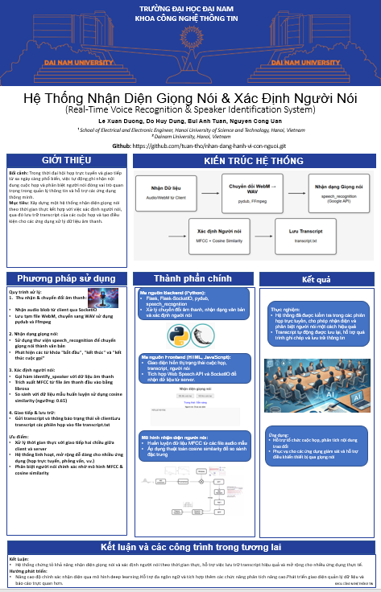

<<<<<<< HEAD
# Nhan-Dien-Giong-Noi
=======
# Hệ thống Nhận diện Giọng nói và Xác định Người nói

  
  

<h3 align="center">Chuyển đổi Âm thanh & Nhận diện Người nói theo Thời gian thực</h3>

  <strong>Hệ thống sử dụng Flask, SocketIO, và mô hình MFCC kết hợp cosine similarity để nhận diện giọng nói và xác định người nói trong các phiên họp</strong>

  <a href="#-kiến-trúc-hệ-thống">Kiến trúc</a> •
  <a href="#-tính-năng-chính">Tính năng</a> •
  <a href="#-công-nghệ-sử-dụng">Công nghệ sử dụng</a> •
  <a href="#-cài-đặt">Cài đặt</a> •
  <a href="#-hướng-dẫn-sử-dụng">Hướng dẫn sử dụng</a> •
  <a href="#-tài-liệu">Tài liệu</a>

## 🏗️ Kiến trúc hệ thống

Hệ thống được xây dựng dựa trên kiến trúc ba tầng:

1. **Backend (Flask & SocketIO)**  
   - Nhận dữ liệu âm thanh từ client qua WebSocket.
   - Chuyển đổi file âm thanh từ định dạng WebM sang WAV sử dụng _pydub_.
   - Chuyển giọng nói thành văn bản qua Google Speech Recognition.
   - Xác định người nói dựa trên MFCC và cosine similarity thông qua mô hình riêng.

2. **Frontend (HTML, JavaScript)**  
   - Giao diện hiển thị trạng thái cuộc họp, transcript và thông tin người nói.
   - Sử dụng Web Speech API để chuyển giọng nói thành văn bản trực tiếp trên trình duyệt.
   - Giao tiếp với server thông qua SocketIO để cập nhật thông tin theo thời gian thực.

3. **Mô hình Nhận diện Người nói**  
   - Trích xuất đặc trưng MFCC từ các file âm thanh huấn luyện.
   - So sánh đặc trưng MFCC của âm thanh đầu vào với dữ liệu mẫu đã huấn luyện để xác định người nói.
## 📂 Cấu trúc dự án
📦 Project  
├── 📂 audio  # Thư mục chứa dữ liệu âm thanh của từng người  
│   ├── 📂 anh_dung  
│   ├── 📂 anh_duong  
│   ├── 📂 anh_tuan  
│   ├── 📂 anh_uan  
├── 📂 models  # Thư mục chứa mô hình nhận diện giọng nói  
│   ├── 📂 pycache  # Cache của Python  
│   ├── speaker_id_model  # Tệp mô hình nhận diện giọng nói  
├── 📂 templates  # Thư mục chứa giao diện HTML  
│   ├── index.html  # Trang web hiển thị thông tin  
├── 📂 trained_data  # Thư mục chứa dữ liệu đã được huấn luyện  
│   ├── speaker_mfcc.json  # Dữ liệu đặc trưng MFCC của từng người  
├── app.py  # Ứng dụng chính chạy nhận diện giọng nói  
├── train.py  # Chương trình huấn luyện mô hình  
├── README.md  # Tài liệu mô tả dự án  

---
## ✨ Tính năng chính

### 🎤 Nhận diện Giọng nói
- **Chuyển đổi Âm thanh:** Dữ liệu âm thanh được chuyển đổi từ WebM sang WAV bằng _pydub_.
- **Chuyển Giọng Nói Thành Văn Bản:** Sử dụng thư viện _speech_recognition_ với API Google để nhận diện và chuyển đổi giọng nói thành văn bản.
- **Lưu Lịch Sử Cuộc Họp:** Transcript của các phiên nói được ghi lại và lưu trữ vào file `transcript.txt`.

### 👤 Xác định Người nói
- **Trích xuất MFCC:** Sử dụng _librosa_ để trích xuất đặc trưng MFCC từ các file âm thanh.
- **So sánh Cosine Similarity:** So sánh MFCC của âm thanh đầu vào với dữ liệu mẫu đã được huấn luyện để xác định người nói.
- **Ngưỡng Xác Định:** Dựa trên ngưỡng tương đồng (0.65 theo mặc định) để quyết định người nói.

### 📡 Giao tiếp Thời gian thực
- **SocketIO:** Giao tiếp hai chiều giữa client và server để cập nhật transcript và trạng thái cuộc họp ngay lập tức.
- **Giao diện Người dùng:** Cập nhật trạng thái, transcript và thông tin người nói trên trình duyệt.

## 🔧 Công nghệ sử dụng

### Core Technologies
  
  

### Libraries & Tools
  
  
  

## 📥 Cài đặt

### 🛠️ Yêu cầu trước
- **Python 3.8+**: Ngôn ngữ lập trình chính.
- **FFmpeg**: Cần thiết cho việc chuyển đổi file âm thanh với _pydub_.
- **Các thư viện Python**: Flask, Flask-SocketIO, pydub, speech_recognition, librosa, numpy.
4️⃣ Chạy các chương trình

✅ Chạy ứng huấn luyện (`tranin.py`):

    python train.py
- Ứng dụng sẽ:

    - Chuẩn bị dữ liệu huấn luyện
    - Script sẽ tạo file speaker_mfcc.json trong thư mục trained_data chứa MFCC trung bình của từng người nói

✅ Chạy ứng dụng chính (`app.py`):

    python app.py

## 📰 Poster

  

## 🤝 Đóng góp
Dự án được phát triển bởi 4 thành viên:

| Họ và Tên       | Vai trò                  |
|-----------------|--------------------------|
| Nguyễn Công Uẩn | Phát triển mã nguồn, kiểm thử, triển khai dự án và làm Poster, Powerpoint.|
| Lê Xuân Dương | Hỗ trợ bài tập lớn, đề xuất cải tiến, thực hiện video giới thiệu.|
| Đỗ Huy Dũng    | Thuyết trình, biên soạn Overleaf, hỗ trợ phát triển mã nguồn, hỗ trợ bài tập lớn.  |
| Bùi Anh Tuấn     | Hỗ trợ bài tập lớn, thu thập dữ liệu.      |

© 2025 NHÓM 10, CNTT16-03, TRƯỜNG ĐẠI HỌC ĐẠI NAM
>>>>>>> 22f42dd (init project)
